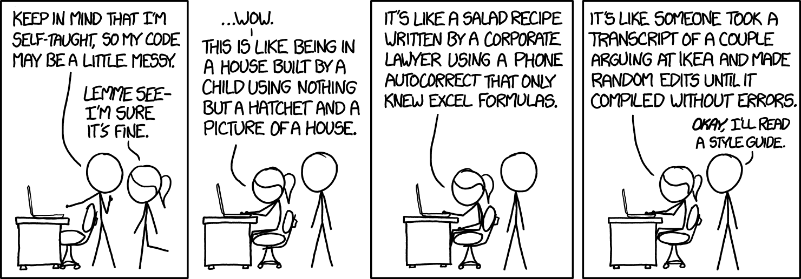

Ever since I downloaded IntelliJ IDEA I have been bombarded by a massive collection of hot-keys, coding styles, and GitHub applications. I now know more than I ever thought I could about what it means to use a coding style, which I didn't even know existed. This was a relief to me because I wanted it to exist, really I did, this is the best news I've had all year and it only took two years of coding to find it. Coding standards are my new joy and I am so relieved that I can now live a life where an IDE that has the right configuration can tell me I'm doing something the wrong way every day. No sarcasm included.

<h3>Coding Standards</h3>

<dl>
A great repo for Javascript coding standards is the [AirBnB Javascript Style Guide]("https://github.com/airbnb/javascript#types"). This helps give an overview of what way is best for declaring variables in Javascript as well as well as providing almost a forceful attitude about using underscore instead of for-loops (which I personally applaud). I think this is a good approach to coding because it not only gets a wayward coder like me into habitual patterns, but also provides a door for me to read another's code with ease if they follow the same style. </d1>
---
<strong> Also, where did ESLint come from and can I keep it? </strong>
I don't know if people usually complain about ESLint, but I certainly am a friend. I used to say that I liked C over things like Javascript, HTML, etc. because I like the orderliness, the rules. ESLint has not come to set the status quo of spaces, curly bracket spacings, and tabs (or spaces? . . . ). One of the many, many things that ESLint doesn't allow is ending a file without an EOL (end of line), not providing function names in underscore functions, concatenating strings together with empty spaces, and keeping the beginning curly bracket on the same line as the function (which may be a weird pet peeve, but it's mine and I'm keeping it).
<dt><strong>"The best applications are coded properly. This sounds like an obvious statement, but by ‘properly’, I mean that the code not only does its job well, but is also easy to add to, maintain and debug." - David Mytton (Why You Need Coding Standards)</strong></dt>
I found this quote while looking over some articles about coding standards and coding styles. As the article goes on the author starts to articulate some problems with sticking with 'your first coding style/language' and meanwhile, making it hard to read or understand if you code in any other language. This can be hard when you are asked to work on a project and most of the coders will want to work in a language that you aren't very comfortable with. I think the best way to become acclimated to another language is by using strict rules (enforced by computers programs such as ESLint) and acting diligently during the process. That way, if there's a bigger problem in your code, your fellow co-workers can quickly identify it because it's not just a hog-posh of using your 'native language's' style most of the time and only the project language when you need to.
---
In conclusions, ever since I started coding I would grow annoyed looking at a classmate's code if it didn't seem to have any kind rhyme or reason to it. I never even considered using spaces rather than tabs, but I can see it's appeal if using an editor like nano where the tabs make an ungodly jump of at least eight spaces. So to whoever you are, whether a fan of spaces or tabs, at least we can all agree that coding standards are important and having editors like IntelliJ IDEA can help us learn to be better coders in both approach and style. And I know that coding standards haven't exactly pushed through the barrier of 'tabs vs. spaces', but everytime someone who spaces annoyingly at you, just to show you how much they don't care that you would rather use tabs, just remember that at least you both agree to put the first curly bracket on the same line as the function.
