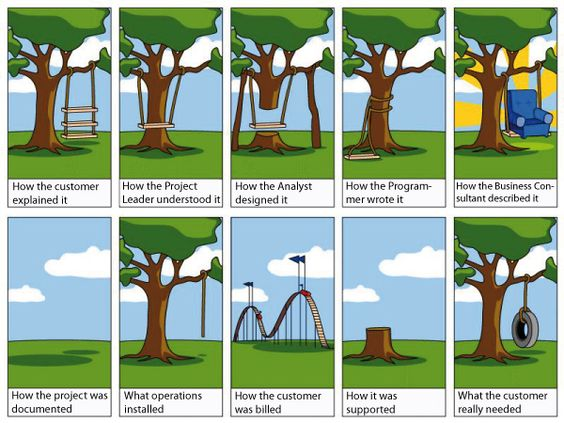

One thing I've learned while driving on the lonely road of late night computer screens and early morning tests is how much I <i>detest, loathe, despise</i> any type of webpage development required of me. Just this year, I've started to stray away from the comforts of my dusty roads like FPGA board programming, object oriented programming, and algorithm classes and took a left turn somewhere a few miles back, driving straight off a cliff into the web development valley, (Looks a little like Las Vegas to me). But why? Why would I hate something that helps me express my creativity? Well, it's too much code, not enough coding.

<h2> Wait, what?</h2>

<dl>
<dt><strong>Let's talk about HTML and CSS</strong></dt>
  <dd>HTML and CSS are easy to learn, I will admit. But the problem with these languages is that I want to make something nice and I want to make it fast, but the amount of loops you have to jump through are ridiculous. Just to get something like this (which is really only a black box with a flag ontop of it) on your webpage you need four different classes, describing margins, borders, width, height, padding, <i>I can go on.</i>  </dd>
  <dt><strong>A small note about comments</strong></dt>
  <dd>WHY? Why, why, why, why. I'm not sure how it makes sense to <i>anybody</i> to use a pair of < ! - - / - - >  to comment anything out when even CSS is like, "no thank you, I will use /* */ like everybody else.</dd>

<h2>  UI Frameworks, an answer to a web developer's prayer. </h2>

  <dt><strong>Semantic UI, the magical land of containers</strong></dt>
  
  <dd>Semantic UI was listed as Number 2 on a list of <a href="https://www.keycdn.com/blog/front-end-frameworks/">Top 10 Front-End Frameworks of 2016</a> and it does not disappoint. I think one of the best things about using a UI Framework is that it does all the tedious tasks for you and you can focus on the aspects of your webpage that you want to focus on. This way you can start easily with a general layout of your webpage and then edit from there.</dd>
  <dt><strong>Documentation at it's finest</strong></dt>
    <dd>The Semantic UI <a href="http://semantic-ui.com"> Home Page </a> is worth checking out. This framework has some amazing outlines you can use and there's a lot of resources on the internet that you can use to learn it. The explanation of each type of element you can implement is clear and concise. I'm mostly learning just by guessing what I would need and then looking through the documentation and tutorials that they have. It's very intuitive and set-up almost seamlessly. I assume it's because I'm used to using stackoverflow for every technical issue I have, and a site that explains a whole framework is a breath of fresh air.</dd>
</dl>

Because of my experience with UI Frameworks, webpage development isn't quite as humbug and tedious as when I first started out and I'm very happy to have found resources like these. I would highly recommend looking into learning Semantic UI (or other UI Frameoworks) if you are interested in developing your skill as a front-end web developer. A good resource (though you have to pay for it past a 7-Day Trial) is <a href="https://www.pluralsight.com/">Pluralsight</a>, a repository of plenty of tutorials on not only UI Frameworks, but Management, Cyber Security, Architecture, and Design.  