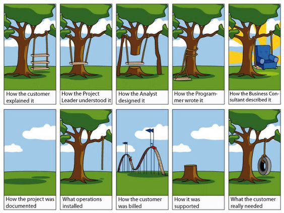

<link rel="stylesheet" href="https://cdnjs.cloudflare.com/ajax/libs/semantic-ui/2.2.2/semantic.min.css">

Let's talk about Meteor for a second. If you don't know what Meteor is, then I'm assuming you're like me: a sad excuse for a Computer Engineering major who has had no prior experience of web or app development and has spent the last four years in college with their face to a screen, trying to figure out the best algorithm for storing values into 'structs' or spending the last half of your semester trying to find the best algorithm for an 'exponentiating' calculator program even though that problem has already been solved a million (roughly) years ago.

<h2> Meteor Did's </h2>

<dl>
<dt><strong>Here's a problem I solved as a Meteor User</strong></dt>
  <dd>When I first started using Meteor, it was a piece of well-frosted cake, I understood command line so there was no problem with installation and basic use. I liked the fact that I could edit it in IntellijIDEA and it seemed to me that my future projects would flow smoothly without any real complications. Wow, what a wonderful fairytale world I was living in.</dd>
  <dd>Unfortunately,as time passed, and I was asked to download more applications in Meteor, it dawned on me that web development is no easy task, unless you think you could make a living off of </dd>
  <dt><strong>A small note about comments</strong></dt>
  <dd>WHY? Why, why, why, why. I'm not sure how it makes sense to <i>anybody</i> to use < ! - - / - - >  to comment anything out when even CSS is like, "no thank you, I will use /* */ like everybody else". I don't know why it bothers me so much, maybe because I'm an avid commentor when I'm trying to debug my code, and this causes little frustrations every time I don't know what I did wrong.</dd>

<h2>  UI Frameworks, an answer to a web developer's prayer. </h2>

  <dt><strong>Semantic UI, the magical land of containers</strong></dt>
  
  <dd>Semantic UI was listed as Number 2 on a list of <a href="https://www.keycdn.com/blog/front-end-frameworks/">Top 10 Front-End Frameworks of 2016</a> and it does not disappoint. I think one of the best things about using a UI Framework is that it does all the tedious tasks for you and you can focus on the aspects of your webpage that you want to focus on. This way you can start easily with a general layout of your webpage and then edit from there.</dd>
  <dt><strong>Documentation at it's finest</strong></dt>
    <dd>The Semantic UI <a href="http://semantic-ui.com"> Home Page </a> is worth checking out. This framework has some amazing outlines you can use and there's a lot of resources on the internet that you can use to learn it. The explanation of each type of element you can implement is clear and concise. I'm mostly learning just by guessing what I would need and then looking through the documentation and tutorials that they have. It's very intuitive and set-up almost seamlessly. I assume it's because I'm used to using stackoverflow for every technical issue I have, and a site that explains a whole framework is a breath of fresh air.</dd>
</dl>

Because of my experience with UI Frameworks, webpage development isn't quite as humbug and tedious as when I first started out and I'm very happy to have found resources like these. I would highly recommend looking into learning Semantic UI (or other UI Frameoworks) if you are interested in developing your skill as a front-end web developer. A good resource (though you have to pay for it past a 7-Day Trial) is <a href="https://www.pluralsight.com/">Pluralsight</a>, a repository of plenty of tutorials on not only UI Frameworks, but Management, Cyber Security, Architecture, and Design.  