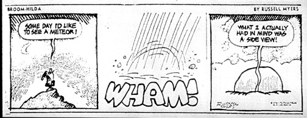

<link rel="stylesheet" href="https://cdnjs.cloudflare.com/ajax/libs/semantic-ui/2.2.2/semantic.min.css">

It's been 3 weeks, 6 days, and approximately 2 hours since I first laid eyes on this brilliant graphic design that brought pain and destruction in it's wake. Am I being overdramatic? Probably. But am I only using this as a tool to show how much I've learned and changed through these few weeks? Plausibly. This past week, I was tasked with the design of my own application and it served as an enormous wake up call (a little resemblance to sirens warning of our impending doom hurtling towards us at 100,000 mph - according to Google search : <a href="https://www.google.com/search?q=how+fast+do+meteors+travel&rlz=1C1CHZL_enUS727US727&oq=how+fast+do+meteors+travel&aqs=chrome..69i57.4272j0j7&sourceid=chrome&ie=UTF-8">how fast do meteors travel</a>). Working on your own (without the direction or help of any classmates or professors) really makes you realize how bad you are at something, and fortunately in my case, it makes me want to get better.

<h2>I'm Still Confused</h2>
<dl>
<dt><strong>How does any of this actually work? What is really going on?</strong></dt>

  <dd>I'm the wrong person to ask, honestly, because I still don't know how I'm doing any of this. I'm making pages and it's like magic to me, yet I'm still doing well in my coding quizzes? I understand how files are referenced from different folders (that's very C-eqsue, and I've spent most of my coding career in college in C), and I understand how the HTML files work with their corresponing JavaScript files, as well as providing routing templates for them. Since I pulled most of my code by starting with the  <a href="http://ics-software-engineering.github.io/meteor-application-template/">meteor-application-template</a>, I became extremely skilled in the art of copy-and-paste. The problem that I'm starting to face from this style of working in Meteor though, is that soon I'll want to employ a task in my application that cannot be copied, but learned. I'm waiting for this - very patiently, in fact I would be completely fine if it never came - because I know that the learning curve for Meteor is when I want something done and it hasn't been done in the templates.</dd>

<h2>My Plan to NOT Be Still Confused</h2>
  <dt><strong>How can I grow in Meteor?</strong></dt> 
  <dd>I've recently joined a team in my class where we need to design our own application with the Meteor platform and Galaxy deployment. I have been thinking about how I can best contribute to my team and make sure I'm pulling my weight (at least) which is, above all things, good for group morale. I've realized that I needed to start changing my attitude about graphic design, usability, and quite frankly, "prettyness". I've spent a large portion of my Computer Engineering studies avoiding any project that needed some kind of user interface or graphical representation, choosing the challenge of perfecting algorithms over someone actually being able to <i>use</i> my program. I'm starting to slowly see the benefit of giving my programs a pretty face and I've decided to work on being more creative with my ideas for my final project so that, in time, I will learn the full potential of Meteor and create a project that I'm actually proud of (doesn't actually happen too often). One of the best ways to learn the incitracies of a platform is try implement and idea <i>exactly</i> as you see it in your head. I'm planning on working really hard to realize these things.</dd>
</dl>

With this in mind, I'm still a little scared. There seems to be a lot I still don't know about Meteor even after practicing with the platform for 3 weeks, 6 days, and approximately 2 hours. Is there something lurking on the horizon?

