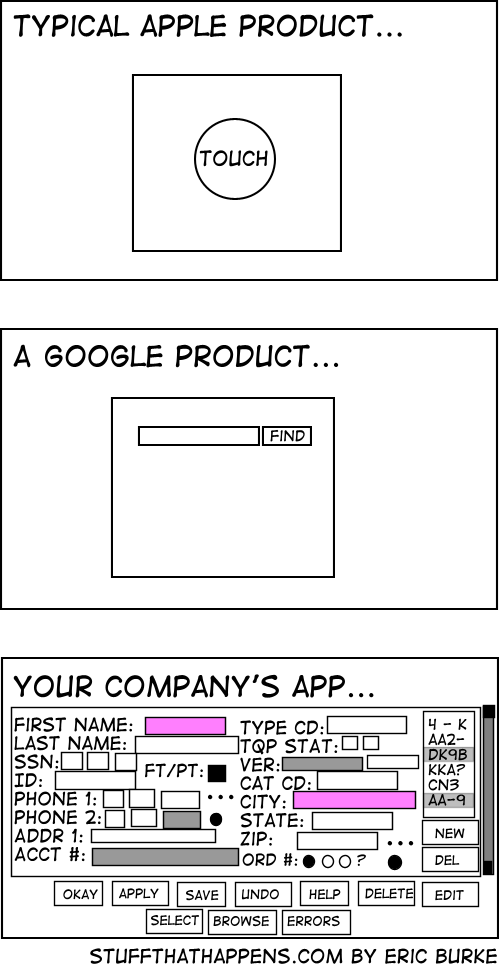

When I was about 10, I watched my uncle take apart our home desktop computer, replace the motherboard and ribbon cable, put it back together and turn it on again. He was a professor at Honolulu Community College and taught in the Computing, Electronics, & Networking Technology program. Even though it has nothing to do with software engineering, it sparked my interest in computers at a young age and when I looked into college options, I decided I wanted to make more money (according to google) than my Civil Engineer older sister, so I chose Computer Engineering and hit two birds with one stone.

## Why I chose Software Engineering
I actually wish I had considered ICS when I was looking into what degree I should study for; ICS had bigger focus on software than Computer Engineering, and I didn't need to take circuits (which I'm definitely glad I'm finished with). I started to get more interested in software Engineering after watching Silicon Valley, a show that started in 2014 from HBO. I always enjoyed by coding classes a lot more than my computer hardware classes (in the sense that I completely despised my computer hardware classes and I loved programming). I'm not sure if I would ccategorize my interests in software engineering, but I currently taking focus courses that teach cyber-security and network algorithms. I definitely see myself in that kind of environment for work and I'm learning Software Engineering so that I can broaden my knowledge in different coding styles and methods.

## What I hope to learn from Software Engineering

This is one of my favorite comics and it describes how I program to a tee. I think the reason I've mostly avoided "software engineer" specific things is because I don't see myself as creative a person as those people I think would be great software engineers. That's a big weakness of mine, getting the job done and not caring how usable it is, but rather that it works and works efficiently. Since it is a weakness I hope to strengthen my creativity with user interfaces and dedicate more time and effort to make a program that not only works well, but is usable. I look forward to being challenged in that area and I am excited to find out how creative I can be.

