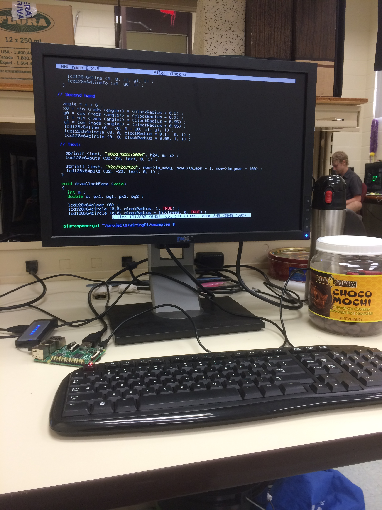
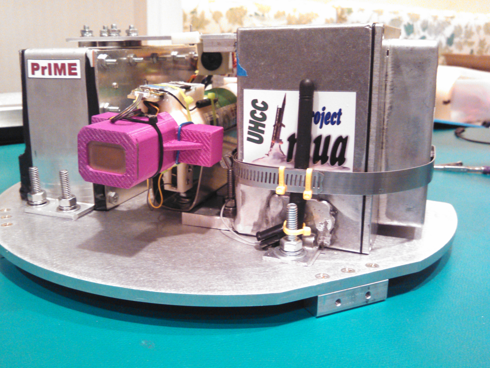
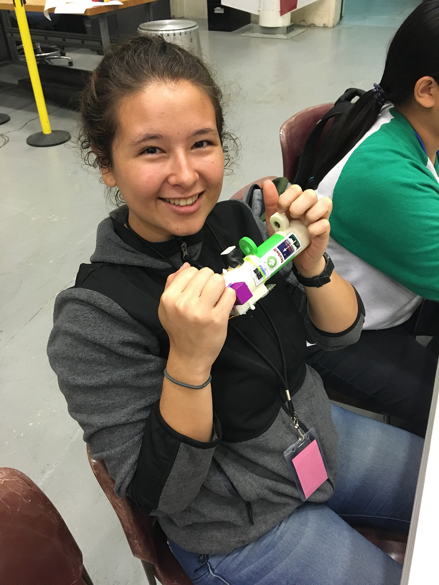

The first Project Imua payload was successfully launched and recovered and so we designed another space-ready payload that would follow all criteria provided by Colorado Space Grant Consortium (COSGC). This year, all campuses designed a subsystem/experiment that worked cohesively with all other subsystems to make one scientific unit, PrIME (Project Imua Multiple Experiment). We divided the experiments by order of priority and listed them as follows: 
Primary Experiments
  -Measure thermal neutron and gamma background radiation
  -Deploy sublimation rocket from payload bay near apogee of sounding rocket
  -Capture video of sublimation rocket’s release from CarRoLL.
Secondary Experiments
  -Evaluate 9-axis motion tracking device
  -Transmit video from “out-board” rocket-mounted camera to deck

As Team Lead at Windward Community College, I worked with all members of the team at each Community College to make sure there was adequate communication between "subsystems", so the designs would be integrated smoothly. Windward's design was a small sublimation rocket and I describe the theories and concepts below:
The super simple sublimation rocket “ScubeR” is designed to provide data for a proof-of-concept of the sublimation properties of naphthalene in vacuum space. This 3D printed rocket is specifically designed to have no moving parts, no heating elements, and  is mounted to a stepper motor via a threaded drive and slowly released at a minimum constant velocity of ~2.5 cm/s, clearing the CarRoLL before apogee. Sublimation of the naphthalene will act as a fuel source for ScubeR and theoretically provide a sufficient thrust once it is released from the threaded drive to create noticeable acceleration in video footage from the Mobius Camera System. Compressed Naphthalene has a triple point of 353 K and 1.059 kPa and is expected to sublimate between 0.25 Pa - 1.3 Pa. ScubeR is designed using the opensource solid 3D CAD rendering software, OpenSCAD, which uses a coding platform for the design development. A software with a code centric platform was chosen to provide a hands on learning experience with basic syntax and translation of code to 3D imagery in the C coding language. These 3D CAD drawings were used with a Lulzbot TAZ 5 3D printer and the corresponding software.

I had two main responsibilities: design the 3D parts to be printed at Windward Community College and program the stepper motor to release the ScubeR under the timing constraints provided by COSGC. I used Python as the programming language and implemented it using the gpio capabilities of the Raspberry-Pi B.

Want to know a little more about our project and see what happened with our payload after the August 2016 launch? Click on this link [PAST THE ATMOSHPERE](https://vimeo.com/189246610)
 
Source: <a href="https://github.com/theVacay/vacay"><i class="large github icon"></i>theVacay/vacay</a>
