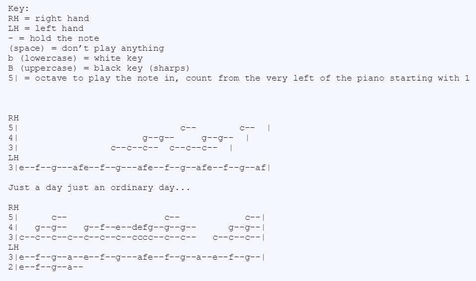

I had taken formal piano lessons fromg 6-10 years old. The pieces, if not mainly for learning techniques or theory, were mostly classical. I enjoyed it so much that when I stopped having lessons I would play the same classical pieces over and over again from memory. Once I realized that I was annoying my sisters too much, I decided to started learning again. The first song I learned was the theme song to NBC's "The OFfice": this link is the video I learned from [The Office Theme Song](https://youtu.be/TVP7_AiXgJM).

This method mostly uses the concept of sight-learning and playing-by-ear. In this case I learned mainly through videos where the camera angle was appropriate to see which keys the fingers touched. The playing-by-ear method is used in addition to this method so that I can also learn how the right hand (treble cleft) is played with the left hand (bass cleft). Unfortunately, one of obstacles of this method is the ability to find a quality video that has a good angle and a techniqued pianist. This has caused a lot of frustrattion in the past, but it's managable.

Another method I've used is learning via tablature, but this has a big problem in the instrument community and especially among the "purists". Here is an example of how tablurature is used to learn song riffs and melodies with the song Ordinary Day by Vanessa Carlton. This image was pulled from tabnabber.com

A big problem with this method of learning is that it's based on sight reading, but not the right kind. Tabluratures have the names of notes and it's written in patterns to help better understand the values of the notes (or how many beats each note takes). It's dangerous to play the tablature game because if you ever want to start learning sheet music, it will be extremely difficult to break the habit of reading music in tablurature form and reading sheet music.

