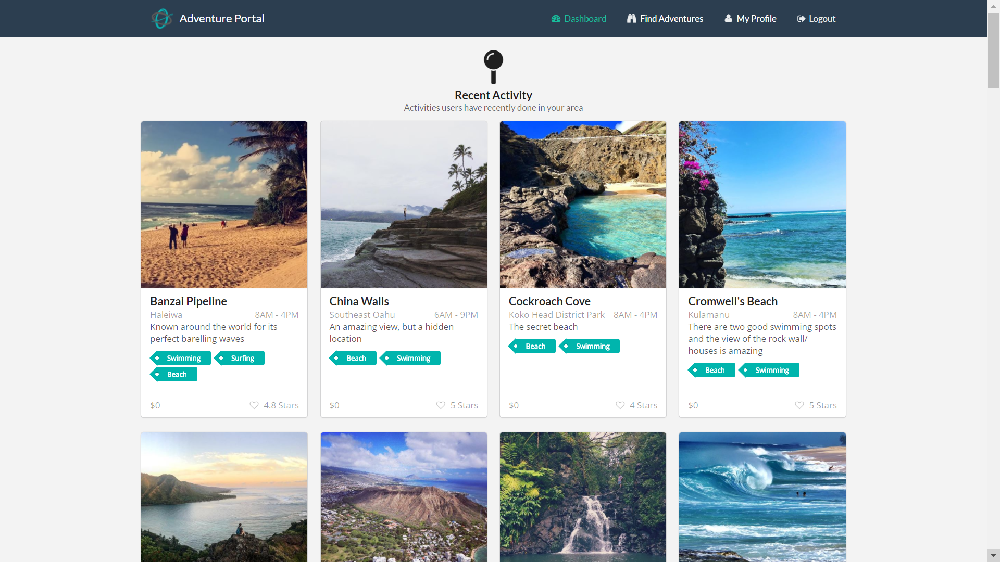
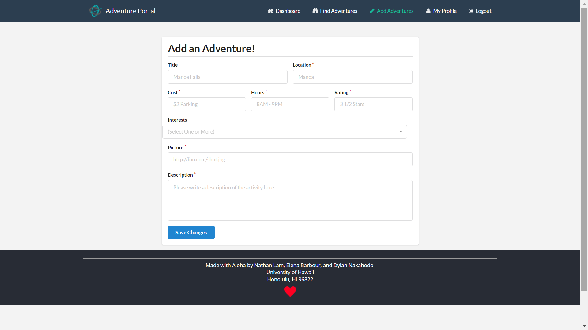

<link rel="stylesheet" href="https://cdnjs.cloudflare.com/ajax/libs/semantic-ui/2.2.2/semantic.min.css">

During my ICS 314 class I formed a group with classmates and worked on a real world application for our final project. We decided to access our more "active" side and develop and app that will help students find different physical activities in the area to explore and enjoy the beauty of Hawai'i. As with many projects, we had a little bit of planning, a little bit of implementing, and a lot of troubleshooting. We were able to complete our Milestones by our specified deadlines and now have an intuitive and usable app for our individual portfolios.

My contributions consisted of the creation and display of the "Activity" collection, in which we could store different activities and any relevant information about them. The activity should have a description, location, price (some hikes require payed parking), what types of interests it falls under for easy searching, and time accessible. I also implemented the disaply of the activity collection through cards on our dashboard page. Other contributions are the "add activity" page, in which users can input their own activities to share with other users.

Some challenges faced from this application is the implementation of a collection of activities that could be easily access and seen in the most appealing way. As with many applications, aesthetics play an important role in development, and as much as we want our insides to act efficiently and be understood, we also want the appearance to be "easy on the eyes".
 
 Another challenge that I faced was implementing a collection as a field in another collection. When trying to connect these two collections, it's difficult to implement user options without really understanding what your code is doing. As I tried to implement my "Interests" collection (which you will be able to see through our link, they manifest as "tags") as tages to my "Activity" collection. In some ways it was difficult to provide usability with a dropdown menu when a user adds their own activity to the database.
 
 Any interested coders or readers are welcome to check out this project: 
 [Adventure Portal](https://adventure-portal.github.io/).
